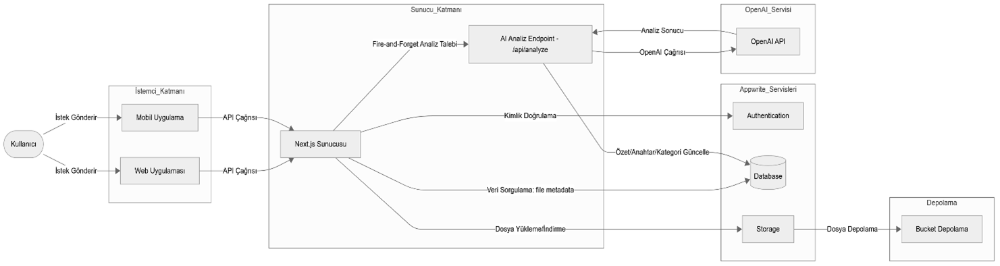
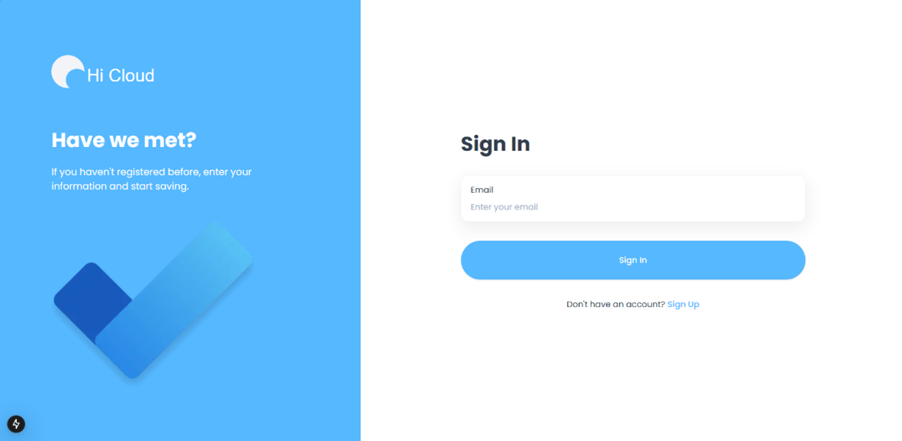
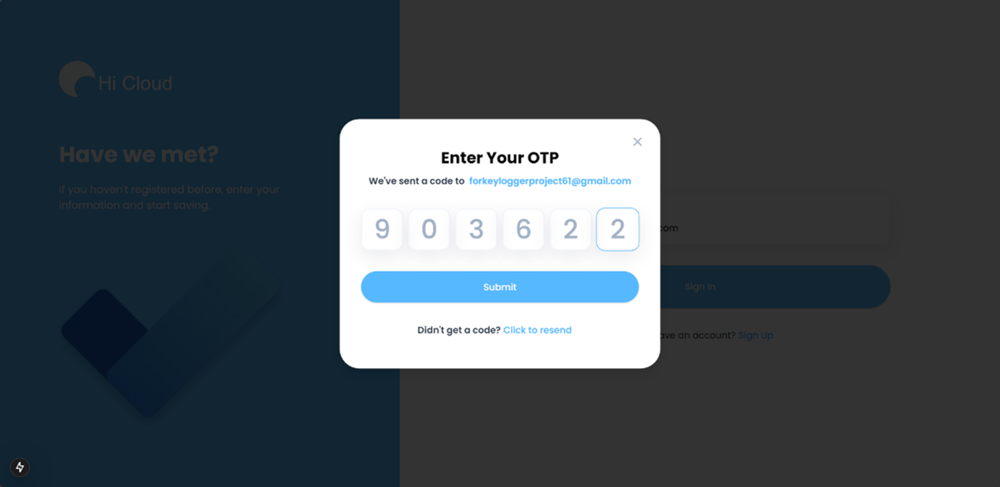
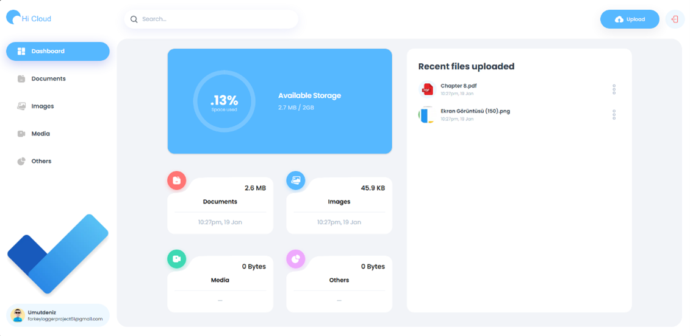
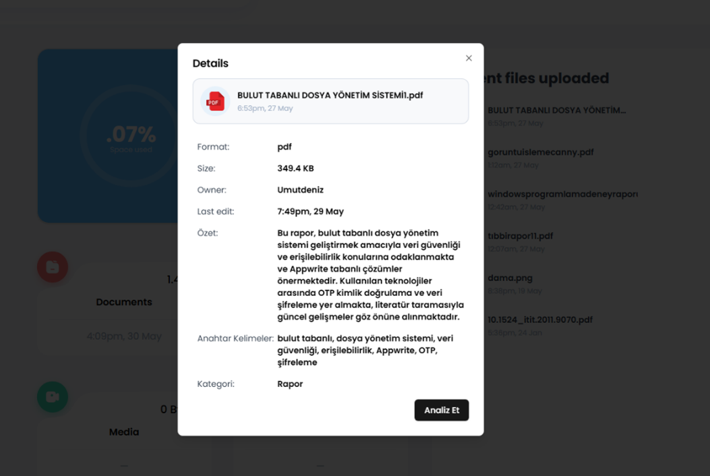

# AI Destekli Bulut Depolama Sistemi

## 📖 Proje Tanımı
Bu çalışma, React 19 ve Next.js 15 tabanlı ön yüz ile Appwrite altyapısını birleştirerek,  
kullanıcıların farklı formatlardaki dosyaları güvenli bir bulut ortamına yükleyip yönetmesini sağlar.  
Yükleme sonrası OpenAI “gpt-4o-mini” modeliyle otomatik özet, anahtar kelime çıkarma  
ve kategori atama işlemleri gerçekleştirerek AI destekli arama-filtreleme deneyimi sunar .

## 🏛️ Mimari Tasarım
Çok katmanlı mimari;  
- İstemci (Next.js)  
- İş mantığı (REST API + Appwrite)  
- Depolama & Kimlik (Appwrite Storage & Auth)  



## 🛠️ Kullanılan Teknolojiler
- **Front-end:** React 19, Next.js 15  
- **Back-end:** Appwrite Authentication, Database, Storage  
- **AI Analiz:** OpenAI GPT-4o-mini  

## 🖥️ Kullanıcı Arayüzleri

### 1. Giriş Ekranı
Basit, duyarlı bir tasarımla kullanıcı kaydı/girişi sağlar.  
 :contentReference[oaicite:0]{index=0}

### 2. OTP Doğrulama Modalı
E-posta ile tek seferlik şifre gönderimi ve doğrulama için modal pencere.  
 :contentReference[oaicite:1]{index=1}

### 3. Ana Sayfa
Dosya yükleme, indirme, arama-filtreleme ve AI analiz sonuçlarını görüntüleyen pano.  
 :contentReference[oaicite:2]{index=2}

### 4. AI Destekli İçerik Analizi
Yükleme sonrası dosya içeriği, OpenAI “gpt-4o-mini” modeli kullanılarak otomatik özetlenir, anahtar kelimelere ayrılır ve uygun kategoriye atanır .  


## 🚀 Kurulum & Çalıştırma
1. Depoyu klonlayın  
   ```bash
   git clone https://github.com/KULLANICI_ADINIZ/ai-destekli-bulut-depolama.git
   cd ai-destekli-bulut-depolama
